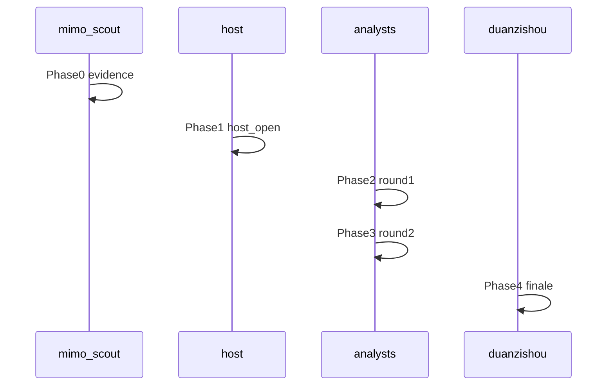

# 段子手角色 + 去掉纪要 + UI 优化（保留左右交错）

## 需求理解

| 项 | 方案 |
|----|------|
| 新角色「段子手」 | 硅基流动 `Pro/moonshotai/Kimi-K2.6`，轻松诙谐地**分析/点评整场结果** |
| 去掉「团子纪要」 | 删除 engine Phase4 `minutes`、前端纪要卡片、SSE `minutes` 事件 |
| 气泡展示 | **保留左右交错**（`index % 2` 左右交替）；主持人开场、联网资料仍居中；在此基础上做视觉精致化 |
| UI 更精致 | 收紧排版、柔和配色、席位与右栏层次、气泡阴影与 Markdown 样式 |

---

## 1. 新增角色 Markdown

新建 [`content/tuanzi/roles/duanzishou.md`](content/tuanzi/roles/duanzishou.md)：

```yaml
id: duanzishou
name: 段子手
title: 诙谐点评席
avatar: /tuanzi/avatars/duanzishou.svg
accent: "#e879f9"
provider: siliconflow
model: Pro/moonshotai/Kimi-K2.6
modelLabel: Kimi K2.6
selectable: true
```

正文 prompt：根据议题 + 资料包 + 全场发言，用**轻松、幽默、不刻薄**的口语化点评；可适度玩梗，扣住讨论内容；不写正式会议纪要。

配套：[`public/tuanzi/avatars/duanzishou.svg`](public/tuanzi/avatars/duanzishou.svg)

更新 [`content/tuanzi/README.md`](content/tuanzi/README.md)

---

## 2. 引擎：段子手终评替代团子纪要

修改 [`src/lib/tuanzi/engine.ts`](src/lib/tuanzi/engine.ts)：



- 删除 `minutes` 阶段及 `Meeting.minutes`、SSE `minutes` 事件
- 新增 `finale`：参与者含 `duanzishou` 时，round2 后单独调用段子手终评
- [`content/tuanzi/roles/tuanzi.md`](content/tuanzi/roles/tuanzi.md)：团子只负责开场，删除纪要职责

---

## 3. 前端：去掉纪要 + 默认选中段子手

[`src/components/tuanzi/RoundtableClient.tsx`](src/components/tuanzi/RoundtableClient.tsx)：

- 删除纪要 state / UI / SSE
- 默认勾选已配置 Key 的：`glm-analyst`、`deepthinker`、`duanzishou`

[`src/content/site.ts`](src/content/site.ts)：删除 `minutesTitle`，副标题可改为「讨论结束后段子手诙谐点评」

---

## 4. 气泡：保留左右交错 + 精致化

[`src/components/tuanzi/UtteranceBubble.tsx`](src/components/tuanzi/UtteranceBubble.tsx)：

- **保留** `index % 2` 左右交替与 `flex-row-reverse`
- **保留** 主持人 / 联网资料居中样式
- 删除 `minutes` phaseLabel；新增 `finale` → 「终场点评」
- 段子手终评气泡可用紫色 accent 轻量高亮（与角色 frontmatter 一致）
- 微调：气泡最大宽度、圆角尾巴方向、header 与 Markdown 间距

不新增统一左对齐 Timeline 组件（与交错布局冲突）。

---

## 5. UI 精致化

| 区域 | 调整 |
|------|------|
| [`RoleSeat.tsx`](src/components/tuanzi/RoleSeat.tsx) | 更细腻的选中态、圆角与间距 |
| 右栏 transcript | 背景 `bg-[#fffcf7]`、内阴影、实录标题样式 |
| [`BubbleMarkdown.tsx`](src/components/tuanzi/BubbleMarkdown.tsx) | 行高、列表、代码块圆角 |
| 桌面左右分栏 | **保留**（PR #22），不换结构 |

---

## 6. 验证

- `npm run build` 通过
- 流程：evidence → 开场 → 2 轮 → 段子手终评，**无纪要区**
- 分析席气泡仍 **左右交错**；主持人/探子居中
- 段子手显示 `Kimi K2.6` 标签

---

## 涉及文件

| 操作 | 路径 |
|------|------|
| 新增 | `content/tuanzi/roles/duanzishou.md`, `public/tuanzi/avatars/duanzishou.svg` |
| 改 | `tuanzi.md`, `engine.ts`, `types.ts`, `RoundtableClient.tsx`, `UtteranceBubble.tsx`, `RoleSeat.tsx`, `BubbleMarkdown.tsx`, `site.ts`, `README.md` |
