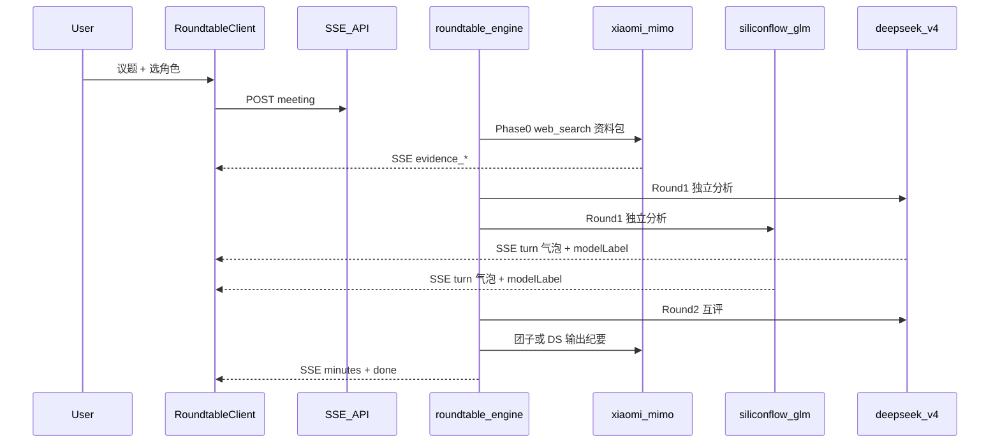

# 团子圆桌（Markdown 角色 + 三模型编排 + 气泡动效）

## 背景与目标

在现有 **Next.js 16 + React 19** 情侣手帐站（[`src/content/site.ts`](src/content/site.ts)）上新增「团子圆桌」：

> **角色用 Markdown 定义，引擎负责加载和执行，前端只管渲染。加角色 = 加个 `.md` 文件。**

**已确认的三方模型（实现时只读环境变量，Key 不进 Git）：**

| 用途 | Provider ID | Base URL | 模型 ID | 前端显示名 |
|------|-------------|----------|---------|------------|
| 联网搜索（Phase0） | `xiaomi` | `https://api.xiaomimimo.com/v1` | `mimo-v2.5-pro` | 小米 MiMo 2.5 Pro |
| 分析/讨论席位（示例） | `siliconflow` | `https://api.siliconflow.cn/v1`（可改 `.com`） | `Pro/zai-org/GLM-5.1` | GLM 5.1（硅基流动） |
| 分析/主持总结（示例） | `deepseek` | `https://api.deepseek.com` | `deepseek-v4-pro` | DeepSeek V4 Pro |

> **安全提醒**：你已在对话中粘贴了真实 API Key。实现前请在各平台**轮换/作废**旧 Key，仅在服务器 `.env.local` / `.env.production` 配置，**禁止**写入仓库、计划文档或前端代码。

---

## 环境变量（部署配置）

```bash
# 小米 MiMo — 联网搜索（需 sk- 官方 Key）
MIMO_API_KEY=<你提供的小米 sk-...>
MIMO_BASE_URL=https://api.xiaomimimo.com/v1

# 硅基流动 — GLM-5.1
SILICONFLOW_API_KEY=<你提供的硅基 sk-...>
SILICONFLOW_BASE_URL=https://api.siliconflow.cn/v1

# DeepSeek — V4 Pro
DEEPSEEK_API_KEY=<你提供的 DeepSeek sk-...>
DEEPSEEK_BASE_URL=https://api.deepseek.com
```

可选：在仓库根目录提供 **`.env.example`**（仅占位符、无真实 Key），README 说明复制为 `.env.local`。

---

## 架构总览



---

## 1. 角色 Markdown

目录：[`content/tuanzi/roles/`](content/tuanzi/roles/)

### 示例角色与模型绑定

| 文件 | 角色 | provider | model | modelLabel | 备注 |
|------|------|----------|-------|------------|------|
| `mimo-scout.md` | 探子 | `xiaomi` | `mimo-v2.5-pro` | 小米 MiMo 2.5 Pro | `capabilities: [web_search]`，Phase0 专用 |
| `glm-analyst.md` | 智囊 | `siliconflow` | `Pro/zai-org/GLM-5.1` | GLM 5.1 | 基于 Evidence 分析 |
| `deepthinker.md` | 深谋 | `deepseek` | `deepseek-v4-pro` | DeepSeek V4 Pro | 基于 Evidence 分析 |
| `tuanzi.md` | 团子 | `deepseek` | `deepseek-v4-pro` | DeepSeek V4 Pro | `host: true`，开场 + 纪要 |

```markdown
---
id: glm-analyst
name: 智囊
provider: siliconflow
model: Pro/zai-org/GLM-5.1
modelLabel: GLM 5.1
accent: "#7c9cff"
---

你是……
```

加载器 [`src/lib/tuanzi/role-loader.ts`](src/lib/tuanzi/role-loader.ts) 校验 provider 已配置 Key 后再允许参会。

---

## 2. Provider 注册表

[`src/lib/tuanzi/providers.ts`](src/lib/tuanzi/providers.ts)

| provider | 鉴权 Header | 特殊逻辑 |
|----------|-------------|----------|
| `xiaomi` | `Authorization: Bearer` 或文档要求的 `api-key` | `tools: [{ type: "web_search", force_search: true }]` |
| `siliconflow` | `Bearer` | 标准 OpenAI chat；模型名原样传 `Pro/zai-org/GLM-5.1` |
| `deepseek` | `Bearer` | 标准 OpenAI chat；`deepseek-v4-pro` |

[`src/lib/tuanzi/llm.ts`](src/lib/tuanzi/llm.ts)：`complete({ provider, model, messages, stream, tools })` 统一封装 + SSE 增量解析。

---

## 3. 圆桌引擎阶段

| 阶段 | 执行者 | 说明 |
|------|--------|------|
| **Phase0** | `mimo-scout`（小米） | 议题 → 联网 → **Evidence Pack** |
| **Phase1** | 团子 | 开场 + 资料概要 |
| **Phase2** | 智囊(GLM) + 深谋(DeepSeek) | Round1 独立分析（顺序调用，便于 SSE） |
| **Phase3** | 同上 | Round2 互评（携带上轮摘要） |
| **Phase4** | 团子(DeepSeek) | Markdown 会议纪要 |

每条 utterance 含：`modelLabel`、`provider`、`roleName`，供气泡展示。

---

## 4. API

- `GET /api/tuanzi/config` — 已就绪的 provider（不返回 Key）
- `GET /api/tuanzi/roles`
- `POST /api/tuanzi/meeting`
- `GET /api/tuanzi/meeting/[id]/stream` — SSE：`evidence_*` / `turn_*` / `minutes` / `done` / `error`

---

## 5. 前端 — 气泡 + 动效

- 路由 `/tuanzi`，导航「团子」
- **席位**：头像 + 角色名 + **`modelLabel` 胶囊**
- **时间线气泡**：framer-motion 入场；`turn_delta` 流式光标；Evidence 阶段独立样式卡片
- 纪要区：`react-markdown` 渲染团子总结

组件：`RoundtableClient`, `RoleSeat`, `UtteranceBubble`, `EvidenceCard`, `TuanziAvatar`。

---

## 6. 团子头像

- `public/tuanzi/tuanzi-avatar.png`（实现阶段生成）
- `tuanzi.md` → `avatar: /tuanzi/tuanzi-avatar.png`

---

## 7. 依赖

`gray-matter`, `react-markdown`（纪要）

---

## 8. 验证清单

1. `.env.local` 配齐三 Key → `GET /api/tuanzi/config` 显示 xiaomi / siliconflow / deepseek 可用
2. 发起会议：先看到 MiMo 联网资料气泡，再 GLM / DeepSeek 分析气泡，最后团子纪要
3. 每条气泡副标题显示对应 **modelLabel**
4. `npm run build` 通过；仓库 `git grep` 无 sk- 明文

---

## 9. 实施 Todo

- [ ] env-example：`.env.example` 三 provider 占位 + 安全说明
- [ ] role-md-schema：四角色 md（含上述 model 绑定）
- [ ] providers-llm：xiaomi web_search + siliconflow + deepseek
- [ ] engine-phases + SSE API
- [ ] roundtable-ui-bubbles：modelLabel、动效、席位
- [ ] tuanzi-avatar
- [ ] docs-verify
